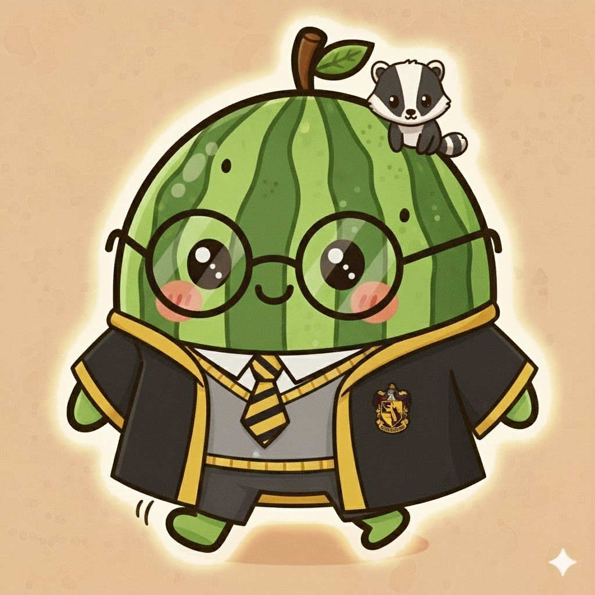
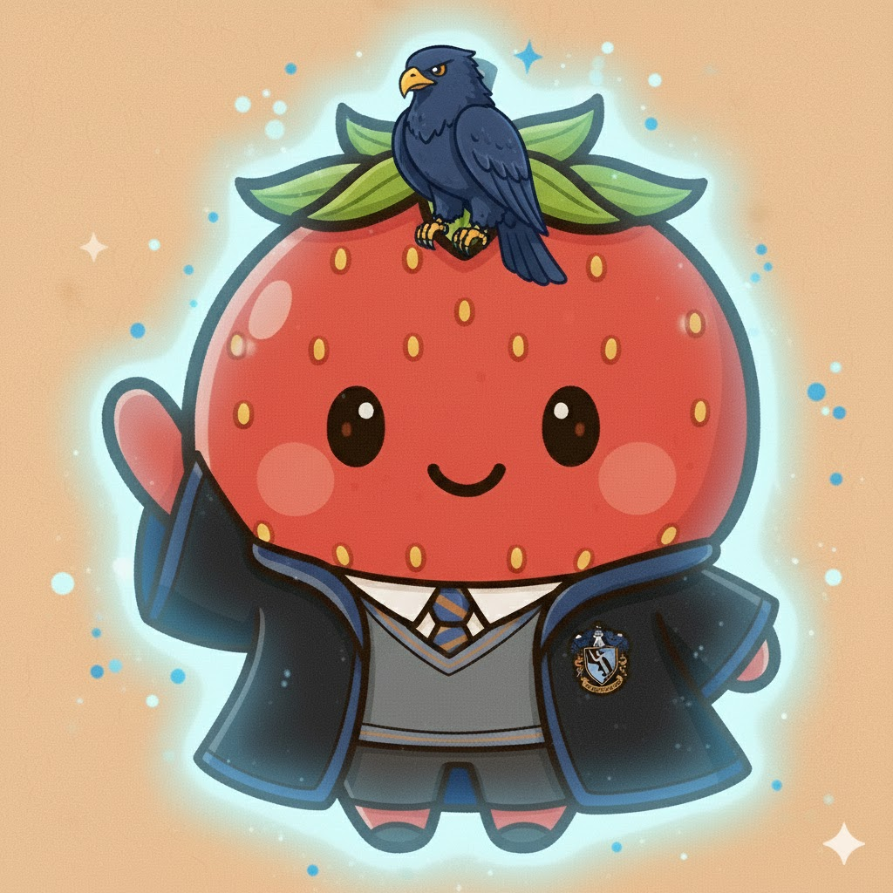

<h1 style="display:flex; align-items:center; gap:8px;">

  
  Moni
</h1>

## 🌨️프로젝트 주제
### ❄️Moni (Money + Monitor)
│ 당신의 소비를 모니터링해주는 당신만의 AI 금융 코치
      
### ❄️프로젝트 일정
│ 기간 : 2025-10 ~ 2026-01
      

 Moni main Git 

- [Moni-git](https://github.com/Sohyeon-Park-git/Moni)

## ☃️ 팀원 소개
| 박시하 | 박소현 | 김단하 | 홍예은 |
|-------|--------|--------|--------|
|  |  |  |  |
| **팀장** | **** | **** | **** |
| - 데이터 엔지니어링 - 데이터 전처리  & 데이터 분석 - AI & LLM 모델 개발 - 클라우드 개발 | - 프론트/백엔드 개발 - 데이터 엔지니어링 - 데이터 전처리  & 데이터 분석 - AI 모델 개발 | - 프론트/백엔드 개발 - 데이터 시각화 - ML 모델 개발| - 프론트/백엔드 개발 - 데이터 시각화 - ML 모델 개발 |

   

## 💻Tech 

FrontEnd : 

BackEnd : 

DataBase :  

API :  

Infra : 

   

# 📄 프로젝트 문서

 프로젝트 기획서

- [프로젝트 기획서.pdf](report/프로젝트%20기획서.pdf)

 요구사항 정의서

- [요구사항 정의서.xlsx](report/요구사항%20정의서.xlsx)

 WBS

- [WBS.xlsx](report/WBS.xlsx)

 모델 정의서 & 성능평가서

- [모델 정의서 & 성능평가서.pdf](report/모델%20정의서%20%26%20성능평가서.pdf)

 함수정의서

- [함수정의서.pdf](report/함수정의서.pdf)

 최종 보고서

- [최종 보고서.pdf](report/최종%20보고서.pdf)

 최종 PPT

- [최종 PPT.pdf](report/최종%20PPT.pdf)

